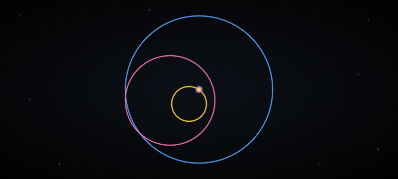

<div align="center">

```
 █████╗ ██████╗ ███╗   ███╗ █████╗ ███╗   ██╗██████╗  ██████╗
██╔══██╗██╔══██╗████╗ ████║██╔══██╗████╗  ██║██╔══██╗██╔═══██╗
███████║██████╔╝██╔████╔██║███████║██╔██╗ ██║██║  ██║██║   ██║
██╔══██║██╔══██╗██║╚██╔╝██║██╔══██║██║╚██╗██║██║  ██║██║   ██║
██║  ██║██║  ██║██║ ╚═╝ ██║██║  ██║██║ ╚████║██████╔╝╚██████╔╝
╚═╝  ╚═╝╚═╝  ╚═╝╚═╝     ╚═╝╚═╝  ╚═╝╚═╝  ╚═══╝╚═════╝  ╚═════╝
        Armando Mac Beath — Robotics & AI
```



### robots, and things that fly

[](https://linkedin.com/in/armandomm09)
[](mailto:pabloarmando.macbeath@gmail.com)
[](#)

</div>

---

so, tell us about yourself.
no.

fine, what do you actually do.
mostly convince computers to point cameras at things and make decisions about what they see. robots, mainly. sometimes rockets, on a good week.

any formal training or did you just wing it.
robotics degree, in progress, plus a fellowship at Meta where they let me near production systems. so a bit of both.

what's the three body thing at the top about.
chaos, technically. i trained a neural net to learn how three bodies orbit each other without blowing up the simulation. it works more often than not.

give us one thing people should know before working with you.
i will overengineer the fun parts and rush the boring ones. it evens out.

ok, we cool?
we cool.

---

<div align="center">

**Languages**


**ML / Robotics**


**Backend / Infra**


</div>

---

<div align="center">

<a href="https://github.com/armandomm09/blue-banner-engine">
  
</a>
<a href="https://github.com/armandomm09/dume">
  
</a>
<br/>
<a href="https://github.com/armandomm09/gym">
  
</a>
<a href="https://github.com/JocelynVelarde/Talent-Land-Slop-as-a-Service">
  
</a>
<br/>
<a href="https://github.com/armandomm09/perceptify">
  
</a>
<a href="https://github.com/Imperator5887/2023-Sauro">
  
</a>

</div>

---

<div align="center">


</div>

---

<div align="center">

`what can I say? I'm surviving.`

</div>
